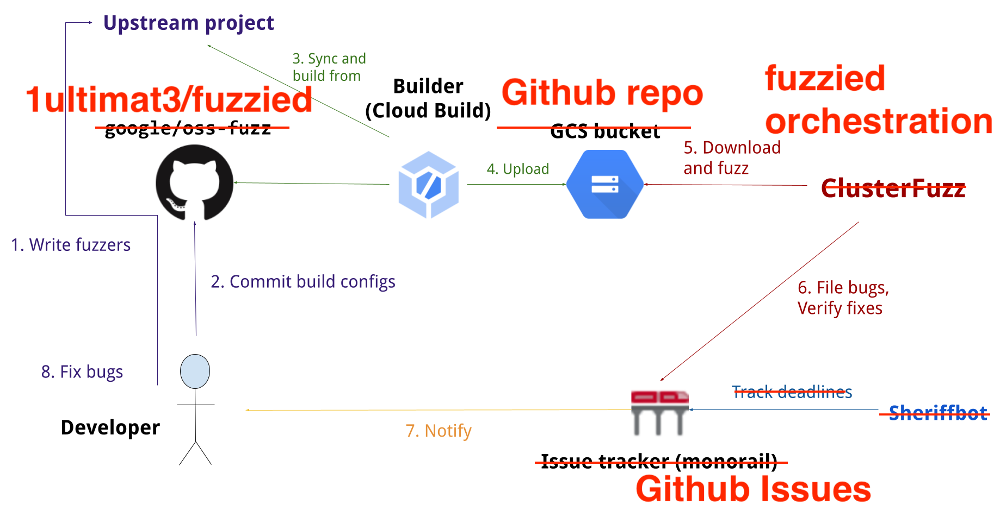

# Fuzzied - Continuous Fuzzing for Smart Contracts
This project is heavily inspired by [oss-fuzz](https://github.com/google/oss-fuzz).

[Fuzz testing](https://en.wikipedia.org/wiki/Fuzzing) is a well-known technique for uncovering programming errors in software. Many of these detectable errors, like reentrancy issues, can have serious security implications.

In cooperation with the **[LOOKING FOR SPONSOR 1]** and the **[LOOKING FOR SPONSOR 2]**, fuzzied aims to make smart contracts more secure and stable by combining modern fuzzing techniques with scalable, distributed execution.

Currently only [echidna](https://github.com/crytic/echidna) is supported. Other fuzzing engine can be integrated in future.

## Overview

## Workflow for Harness Developers
Continuously fuzzed targets can be found in the projects folder.
In order to add your project to the distributed fuzzing procedures, you need to
 1.  fork this repo
 2.  copy/add a project (replace the contracts with yours and add test cases to be validated)
 3.  test locally
 4.  create a pull requests
 5.  once merged, you will be notified if your harness has identified a vulnerability

We want to introduce the following convention with respect to harness writing:
 - The contract **Harness** is the place where all test cases are developed
 - **harness.sol** is where the Harness contract lives
